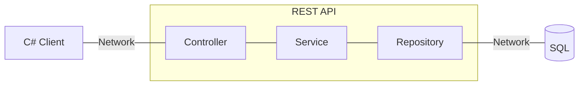
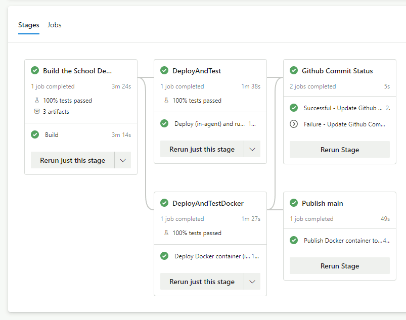

# Harri.SchoolDemoAPI - ASP.NET Core 8.0 REST API

**Harri.SchoolDemoAPI** is a demo REST API built with ASP.NET Core 8.0 that manages students, schools, and applications. It showcases modern .NET backend development practices, including comprehensive automated testing, containerization, structured logging, and CI/CD integration with Azure DevOps.

Also see a front-end Blazor WASM SPA developed for this API here: [Blazor Admin UI](https://github.com/HarrisonSlater/Harri.SchoolDemoAPI.BlazorWASM/)

# Automated Testing
An emphasis on comprehensive automated testing has been used when developing this demo API. 

Included are Unit, Contract, Integration, and E2E test projects.
See the full [Test README here](src/Tests/README.md)

All test projects are run as part of the Azure DevOps pipeline as part of the Build stage (for Unit and Contract) or the 'Deploy & Test' stage (For Integration and E2E), and are run in-agent.

## 🚧 Work In Progress - API
So far the /students/ API is complete: [StudentsApiController.cs](src/Harri.SchoolDemoAPI/Controllers/StudentsApiController.cs)


## Table of Contents
- [JSON API Request/Response examples](#json-api-requestresponse-examples)
- [Running the SchoolDemo REST Web API](#running-the-schooldemo-rest-web-api)
- [Build pipeline](#build-pipeline)
- [Logging using Application Insights & Serilog](#logging-using-application-insights--serilog)
- [Nuget packages used](#nuget-packages-used)

## Project Diagram


# JSON API Request/Response examples
| Operation | Resource        |
|-----------|-----------------|
| POST      | [/students](#post-students) |
| GET       | [/students/{sId}](#get-studentssid) |
| PUT       | [/students/{sId}](#put-studentssid) |
| PATCH     | [/students/{sId}](#patch-studentssid) |
| DELETE    | [/students/{sId}](#delete-studentssid) |
| GET       | [/students](#get-students-paginated-sortable-query-api) |
## POST /students
**Request:**
```http
POST /students
```

**Request Body:**
```json
{
  "name": "Student Name"
}
```
or with optional GPA:
```json
{
  "name": "Student Name",
  "GPA": 3.52
}
```
**Response**  
containing created student ID:
```http
HTTP/1.1 200 OK
Content-Type: application/json

1348
```
## GET /students/{sId}
**Request:**
```http
GET /students/1348
```

**Response**
```http
HTTP/1.1 200 OK
Content-Type: application/json

{
  "sId": 1348,
  "name": "Student Name",
  "GPA": 3.52
}
```
## PUT /students/{sId}
*(Update entire student record)*  

**Request:**
```http
PUT /students/1348
```
**Request Body:**
```json
{
  "name": "Student Name Updated",
  "GPA": 3.65
}
```

**Response**  
```http
HTTP/1.1 200 OK
```

## PATCH /students/{sId}
*(Update partial student record)*

**Request:**
```http
PATCH /students/1348
```
**Request Body:**
```json
{
  "name": "Student Name Patched"
}
```

**Response**  
containing modified student record
```http
HTTP/1.1 200 OK
Content-Type: application/json

{
  "sId": 1348,
  "name": "Student Name Patched",
  "GPA": 3.65
}
```

## DELETE /students/{sId}
**Request:**
```http
DELETE /students/1348
```
**Response**
```http
HTTP/1.1 200 OK
```

## GET /students (Paginated, Sortable, Query API)
### By Id
**Request:**
```http
GET /students?sId=1
```
**Response**
```http
HTTP/1.1 200 OK
Content-Type: application/json

{
  "items": [
    {
      "sId": 1,
      "name": "Olivia Jackson",
      "GPA": 1.43
    },
    {
      "sId": 10,
      "name": "Harper Jones",
      "GPA": 3.94
    },
    {
      "sId": 11,
      "name": "Noah Lopez",
      "GPA": 1.78
    },
    {
      "sId": 12,
      "name": "Liam Taylor",
      "GPA": 3.65
    },
    {
      "sId": 13,
      "name": "Emma Davis",
      "GPA": 1.72
    },
    {
      "sId": 14,
      "name": "Amelia Johnson",
      "GPA": 3.62
    },
    {
      "sId": 15,
      "name": "Harper Taylor",
      "GPA": 1.24
    },
    {
      "sId": 16,
      "name": "Lucas Thomas",
      "GPA": 3.42
    },
    {
      "sId": 17,
      "name": "Ava Rodriguez",
      "GPA": 3.15
    },
    {
      "sId": 18,
      "name": "Benjamin Lopez",
      "GPA": 3.69
    }
  ],
  "page": 1,
  "pageSize": 10,
  "totalCount": 328,
  "totalPageCount": 33,
  "hasNextPage": true,
  "hasPreviousPage": false
}
```
---
### By Name
**Request:**
```http
GET /students?name=Ethan%20S&page=1&pageSize=3
```
**Response:**
```http
HTTP/1.1 200 OK
Content-Type: application/json

{
  "items": [
    {
      "sId": 124,
      "name": "Ethan Smith",
      "GPA": 2.84
    },
    {
      "sId": 137,
      "name": "Ethan Smith",
      "GPA": 3.12
    },
    {
      "sId": 956,
      "name": "Ethan Smith",
      "GPA": 1.35
    }
  ],
  "page": 1,
  "pageSize": 3,
  "totalCount": 3,
  "totalPageCount": 1,
  "hasNextPage": false,
  "hasPreviousPage": false
}
```
---
### By GPA Greater Than, sorted
**Request:**
```http
GET /students?GPA.Gt=2&orderBy=ASC&sortColumn=GPA&page=1&pageSize=4
```
**Response:**
```http
HTTP/1.1 200 OK
Content-Type: application/json

{
  "items": [
    {
      "sId": 324,
      "name": "Harper Johnson",
      "GPA": 2.01
    },
    {
      "sId": 874,
      "name": "Aria Jackson",
      "GPA": 2.03
    },
    {
      "sId": 975,
      "name": "Charlotte Jackson",
      "GPA": 2.03
    },
    {
      "sId": 853,
      "name": "Charlotte Thomas",
      "GPA": 2.04
    }
  ],
  "page": 1,
  "pageSize": 4,
  "totalCount": 694,
  "totalPageCount": 174,
  "hasNextPage": true,
  "hasPreviousPage": false
}
```

<!-- query api template
**Request:**
```
GET /students?sId=1
```
**Response:**
```json
```
-->

# Running the SchoolDemo REST Web API
You have three options for running this web API,

1. Build it from source and run with dotnet sdk. See [Building from source](#building-from-source) below
2. Build a docker container and run. See [Building container from source](#building-container-from-source) below
3. Pull and run a docker container. See [Running from container](#running-from-container) below

   For all options above you will also need to pull and run the [database container](#running-the-database-from-container)

## Building from source
Use the included build scripts in the root of the repo or build in Visual Studio
### Windows

#### PowerShell
>`./build.bat`
#### CMD
>`build`

### Linux
>`./build.sh`

## Running from source
The build script then prompts you to run using
> `dotnet run --project src\Harri.SchoolDemoAPI\Harri.SchoolDemoAPI.csproj`

The API will be accessible via http://localhost:8080 by default

Also make sure to set up the database or the API will return 500 Internal server error
[Running the database from container](#running-the-database-from-container)

## Building container from source
Build the container locally run: 

> `docker build -t schooldemoapi -f .\src\Harri.SchoolDemoAPI\Dockerfile .`

## Running from container
If you built the container yourself locally as above run:

> `docker run -it -p 8080:8080 --name schooldemoapi schooldemoapi`

---

If you don't want to build the container you can pull the latest main branch linux container image from the [DockerHub harri-schooldemoapi repository](https://hub.docker.com/repository/docker/harrisonslater/harri-schooldemoapi/general)

> `docker pull harrisonslater/harri-schooldemoapi:latest`

And run 

> `docker run -it -p 8080:8080 --name schooldemoapi harrisonslater/harri-schooldemoapi:latest`

The API will be accessible via http://localhost:8080 or you can specify a different port in the docker run command above like `5000:8080`

## Running the database from container
The database required by the SchoolDemoAPI is available as a linux container image prefilled with student, school, and application data from the [DockerHub harri-schooldemosql-database repository](https://hub.docker.com/repository/docker/harrisonslater/harri-schooldemosql-database/general)

> `docker pull harrisonslater/harri-schooldemosql-database:latest`

And to run the database container:

> `docker run -e "ACCEPT_EULA=Y" -e "MSSQL_SA_PASSWORD=p@ssw0rd" -p 1433:1433 -d harrisonslater/harri-schooldemosql-database:latest`

# Build pipeline
Azure DevOps pipeline defined [in yaml](https://github.com/HarrisonSlater/Harri.SchoolDemoApi/blob/main/pipeline/azure-pipelines.yml)

A successful pipeline run based on main looks like:


## Pipeline deploying
In a real world pipeline Deploy & Test would be separate stages where Deploy actually deploys to an environment. In this pipeline 'Deploy' just runs the container image / .NET dll in-agent. This is done to remove ongoing hosting costs

# Logging using Application Insights & Serilog
Logging accessible via standard ILogger interface

[.UseHttpLogging();](https://github.com/HarrisonSlater/Harri.SchoolDemoApi/blob/main/src/Harri.SchoolDemoAPI/Startup.cs) is used for request and response body logging

Serilog is fully configured in the appsettings.json

Other than console and debug logs this also logs to:
- Log file: /Logs/log.txt
- Application Insights: set up for local usage within visual studio 
	- Custom events are logged via Serilog
- SEQ: free personal edition that can be run in a container

For App insights and SEQ:
- Requests and responses with body are logged as custom events 
	- `In a production scenario you probably don't want to do this as sensitive data may be logged`

# Health check endpoint /health
Response implemented with [AspNetCore.HealthChecks.UI.Client/UIResponseWriter.cs](https://github.com/Xabaril/AspNetCore.Diagnostics.HealthChecks/blob/master/src/HealthChecks.UI.Client/UIResponseWriter.cs)
to return a result like:
```
{
  "status": "Healthy",
  "totalDuration": "00:00:00.0858619",
  "entries": {
    "sql": {
      "data": {},
      "duration": "00:00:00.0856835",
      "status": "Healthy",
      "tags": []
    }
  }
}
```

Also included is a RestSharp client in a separate project [Harri.SchoolDemoAPI.HealthCheckClient](https://github.com/HarrisonSlater/Harri.SchoolDemoAPI/tree/HealthChecks/src/Harri.SchoolDemoAPI.HealthCheckClient) along with consumer driven contract tests

# Nuget packages used
  - [Dapper](https://github.com/DapperLib/Dapper)
  - [RestSharp](https://github.com/restsharp/RestSharp) for the client
  - [AspNetCore.Diagnostics.HealthChecks](https://github.com/Xabaril/AspNetCore.Diagnostics.HealthChecks)
- ## Logging
  - [Serilog](https://github.com/serilog/serilog)
  - [SEQ](https://datalust.co/seq)
