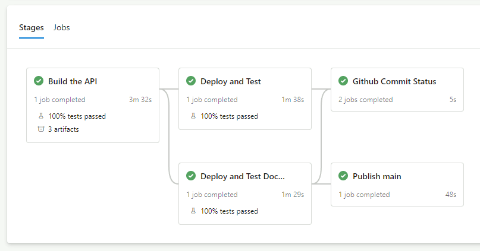

# Harri.SchoolDemoAPI - REST API - ASP.NET Core 8.0 Server

Demo .NET 8 API about students, schools, and student's applications to schools

This repository is intended as a demonstration of a RESTful API with a SQL Server database focusing on automated testing to validate the API functionality.

Also see a front-end Blazor WASM SPA developed for this API here: [Blazor Admin UI](https://github.com/HarrisonSlater/Harri.SchoolDemoAPI.BlazorWASM/)

## WIP - API
So far the /students/ API is complete: [StudentsApiController.cs](https://github.com/HarrisonSlater/Harri.SchoolDemoApi/blob/main/src/Harri.SchoolDemoAPI/Controllers/StudentsApiController.cs)

Using:
  - [Dapper](https://github.com/DapperLib/Dapper)
  - [RestSharp](https://github.com/restsharp/RestSharp) for the client
  - [Serilog](https://github.com/serilog/serilog)
  - [SEQ](https://datalust.co/seq)
  - [AspNetCore.Diagnostics.HealthChecks](https://github.com/Xabaril/AspNetCore.Diagnostics.HealthChecks)
  
# Running the SchoolDemo REST Web API
You have three options for running this web API,

1. Build it from source and run with dotnet sdk. See [Building from source](#building-from-source) below
2. Build a docker container and run. See [Building container from source](#building-container-from-source) below
3. Pull and run a docker container. See [Running from container](#running-from-container) below

   For all options above you will also need to pull and run the [database container](#running-the-database-from-container)

## Building from source
Use the included build scripts in the root of the repo or build in Visual Studio
### Windows

#### PowerShell
>`./build.bat`
#### CMD
>`build`

### Linux
>`./build.sh`

## Running from source
The build script then prompts you to run using
> `dotnet run --project src\Harri.SchoolDemoAPI\Harri.SchoolDemoAPI.csproj`

The API will be accessible via http://localhost:8080 by default

Also make sure to set up the database or the API will return 500 Internal server error
[Running the database from container](#running-the-database-from-container)

## Building container from source
Build the container locally run: 

> `docker build -t schooldemoapi -f .\src\Harri.SchoolDemoAPI\Dockerfile .`

## Running from container
If you built the container yourself locally as above run:

> `docker run -it -p 8080:8080 --name schooldemoapi schooldemoapi`

---

If you don't want to build the container you can pull the latest main branch linux container image from the [DockerHub harri-schooldemoapi repository](https://hub.docker.com/repository/docker/harrisonslater/harri-schooldemoapi/general)

> `docker pull harrisonslater/harri-schooldemoapi:latest`

And run 

> `docker run -it -p 8080:8080 --name schooldemoapi harrisonslater/harri-schooldemoapi:latest`

The API will be accessible via http://localhost:8080 or you can specify a different port in the docker run command above like `5000:8080`

## Running the database from container
The database required by the SchoolDemoAPI is available as a linux container image prefilled with student, school, and application data from the [DockerHub harri-schooldemosql-database repository](https://hub.docker.com/repository/docker/harrisonslater/harri-schooldemosql-database/general)

> `docker pull harrisonslater/harri-schooldemosql-database:latest`

And to run the database container:

> `docker run -e "ACCEPT_EULA=Y" -e "MSSQL_SA_PASSWORD=p@ssw0rd" -p 1433:1433 -d harrisonslater/harri-schooldemosql-database:latest`

## See Contract Tests 
[Contract Test README.md](https://github.com/HarrisonSlater/Harri.SchoolDemoApi/blob/main/src/Tests/Contract/README.md)

Using:
  - [Pact Net](https://github.com/pact-foundation/pact-net)
  - [NUnit](https://github.com/nunit/nunit)
  - [Moq](https://github.com/devlooped/moq)
  - [FluentAssertions](https://github.com/fluentassertions/fluentassertions)

## See Integration Tests
[StudentApiTests.cs](https://github.com/HarrisonSlater/Harri.SchoolDemoApi/blob/main/src/Tests/Harri.SchoolDemoAPI.Tests.Integration/StudentApiTests.cs)

Integration tests are run in-agent using a preconfigured containerised SQL server: [harri-schooldemosql-database](https://hub.docker.com/repository/docker/harrisonslater/harri-schooldemosql-database/general)

## Build pipeline
Azure DevOps pipeline defined [in yaml](https://github.com/HarrisonSlater/Harri.SchoolDemoApi/blob/main/pipeline/azure-pipelines.yml)

A successful pipeline run based on main looks like:


## Logging using Application Insights & Serilog
Logging accessible via standard ILogger interface

[.UseHttpLogging();](https://github.com/HarrisonSlater/Harri.SchoolDemoApi/blob/main/src/Harri.SchoolDemoAPI/Startup.cs) is used for request and response body logging

Serilog is fully configured in the appsettings.json

Other than console and debug logs this also logs to:
- Log file: /Logs/log.txt
- Application Insights: set up for local usage within visual studio 
	- Custom events are logged via Serilog
- SEQ: free personal edition that can be run in a container

For App insights and SEQ:
- Requests and responses with body are logged as custom events 
	- `In a production scenario you probably don't want to do this as sensitive data may be logged`

## Health check endpoint /health
Response implemented with [AspNetCore.HealthChecks.UI.Client](https://github.com/Xabaril/AspNetCore.Diagnostics.HealthChecks/blob/master/src/HealthChecks.UI.Client/UIResponseWriter.cs)
to return a result like:
```
{
  "status": "Healthy",
  "totalDuration": "00:00:00.0858619",
  "entries": {
    "sql": {
      "data": {},
      "duration": "00:00:00.0856835",
      "status": "Healthy",
      "tags": []
    }
  }
}
```

Also included is a RestSharp client in a separate project [Harri.SchoolDemoAPI.HealthCheckClient](https://github.com/HarrisonSlater/Harri.SchoolDemoAPI/tree/HealthChecks/src/Harri.SchoolDemoAPI.HealthCheckClient) along with consumer driven contract tests
