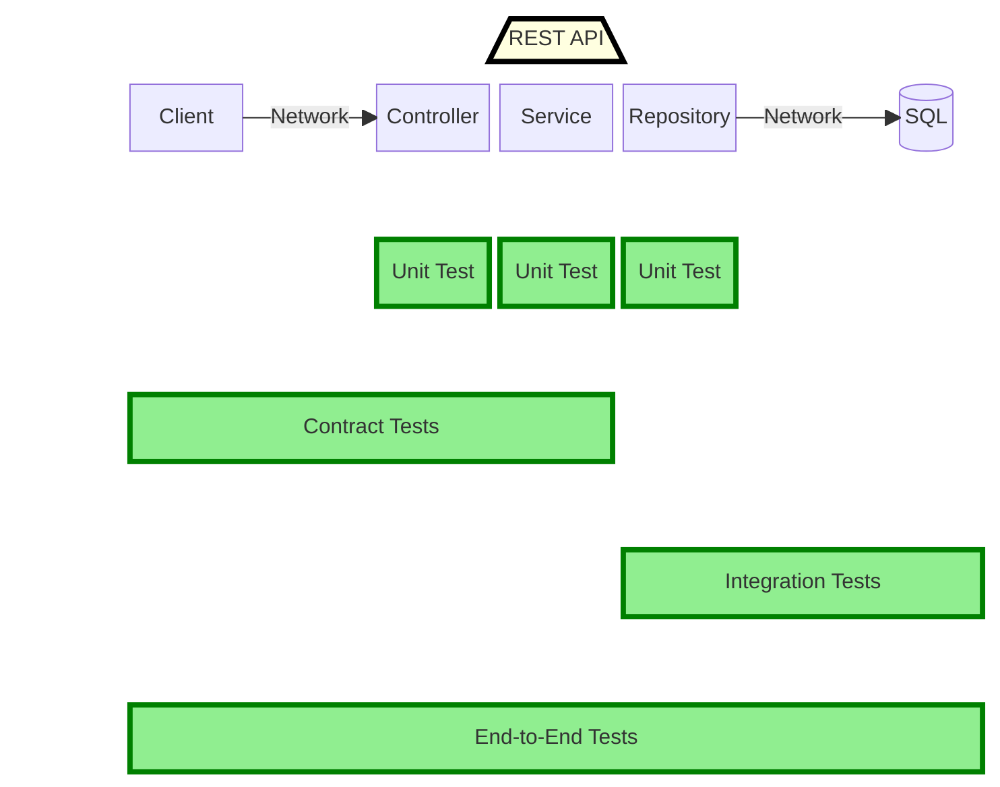

# Test Coverage Diagram

This diagram shows what parts of this REST API are covered by each type of test below.

# [Harri.SchoolDemoAPI.Tests.Unit](Harri.SchoolDemoAPI.Tests.Unit)
Standard Unit test project with mocked dependencies
 
# [Harri.SchoolDemoAPI.Tests.Integration](Harri.SchoolDemoAPI.Tests.Integration)
Tests the integration between the repository module and the actual database.
Integration tests are run in-agent using a preconfigured containerised SQL server: [harri-schooldemosql-database](https://hub.docker.com/repository/docker/harrisonslater/harri-schooldemosql-database/general)

This project covers database testing of:
 - Stored procedures
 - Direct SQL queries via Dapper
 - Mapping of domain models with Dapper

See [Running the database from container](../../README.md#running-the-database-from-container) for setting up a database to run these tests
If this API made calls to another REST API for example, that could be covered here also or in E2E tests below.

The benefits by writing these tests as direct integration tests targeting the repository classes instead of E2E tests:
 - Faster execution time
 - Collect code coverage for the repository classes
 - Direct assertions on the response object from respository methods

# [Harri.SchoolDemoAPI.Tests.E2E](Harri.SchoolDemoAPI.Tests.E2E)

Tests the functionality of the API with realistic use cases.

These tests instantiate the Harri.SchoolDemoAPI.Client to make REST requests to the API and assert an appropriate response is received.
You need a running instance of the SchoolDemoAPI and SQL database to run these tests.

This project covers testing:
 - Scenarios for each route/feature in the API
 - Sanity checks/ Smoke checks to be performed after deployment

## Integration & E2E notes:
Both these projects create new students in a real database and clean up after each test.
This allows for multiple test runs at the same time against a single database as you might have in a shared CI environment, PreProd environment, or even Production environment.

This is an especially useful property for E2E tests as part of a deployment pipeline to enable Continuous deployment.

# Contract Tests 
Consumer driven contract tests using [Pact Net](https://github.com/pact-foundation/pact-net).

Tests for StudentApiClient and StudentApiController have been completed so far.

Contract tests are used in this project to reduce the required number of Integration tests and E2E tests needed to achieve full test coverage of the API.

Benefits of using Contract tests over Integration or E2E tests to validate contracts:
- Contract tests are unit tests
- They run in the build step and fail fast (before deploy step)
- Test execution time (fast)

## Consumer Tests [Harri.SchoolDemoAPI.Tests.Contract.Consumer](Contract/Harri.SchoolDemoAPI.Tests.Contract.Consumer)
Consumer tests validate the API behaviour from the perspective of its consumers. 
The [Harri.SchoolDemoAPI.Client](../Harri.SchoolDemoAPI.Client/StudentApiClient.cs) package is used as the consumer in these tests but you could also write these tests by making direct network requests to the REST API.

The consumer tests also serve as documentation clarifying how different endpoints are intended to be used.

See [StudentApiConsumerTests.cs](Contract/Harri.SchoolDemoAPI.Tests.Contract.Consumer/StudentApiConsumerTests.cs)

## Provider Tests [Harri.SchoolDemoAPI.Tests.Contract.Provider](Contract/Harri.SchoolDemoAPI.Tests.Contract.Provider)

Provider tests assert that a specific json request returns a specific json response, given a state of the provider.
The tests in this project go one step further to assert the object is deserialised correctly within the provider.

The Provider tests have a mocked data layer. This makes the contracts test equivalent to unit tests and can be run in the build step of a CI pipeline for fast feedback.

ProviderStateMiddleware.cs base file implementation from: [Pact Net ProviderStateMiddleware.cs](https://github.com/pact-foundation/pact-net/blob/master/samples/OrdersApi/Provider.Tests/ProviderStateMiddleware.cs)

Assertions are made on the repository interface mock in [ProviderStateMiddleware.cs](Contract/Harri.SchoolDemoAPI.Tests.Contract.Provider/Provider/ProviderStateMiddleware.cs).

The expected values to assert are passed along with the provider state in the contract test definition in the consumer project [Example: StudentApiConsumerTests.cs](Contract/Harri.SchoolDemoAPI.Tests.Contract.Consumer/StudentApiConsumerTests.cs#L20). 
This is so the request json, expected response json, and expected deserialised json all live in the test definition and not hidden and hardcoded in ProviderStateMiddleware.cs.

``` C#
    .Given("a student with sId exists", new StudentDto() { SId = sId, Name = name, GPA = GPA })
```
Deserialising of this object implemented in [GetStateObject<T>](Contract/Harri.SchoolDemoAPI.Tests.Contract.Provider/Provider/ProviderStateMiddleware.cs#:~:text=T%20GetStateObject%3CT%3E)
# [Harri.SchoolDempAPI.Tests.Common](Harri.SchoolDempAPI.Tests.Common)
Common code and helpers used across some or all test projects can live here as well as test data fixtures.

# Nuget packages used
- NUnit
- FluentAssertions
- Moq
- PactNet (Contract tests only)
