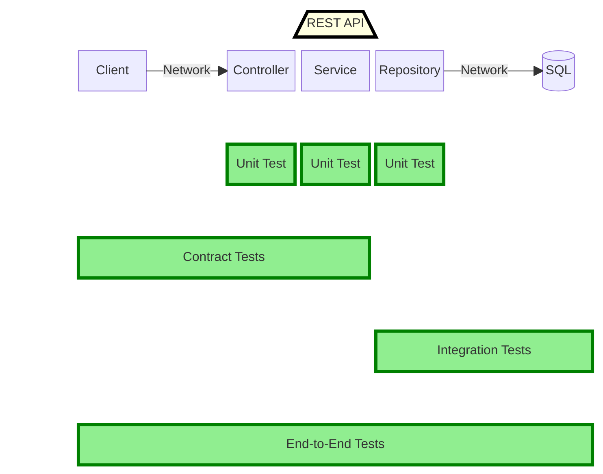

# Test Coverage Diagram

The coverage for each test type is shown in green 
# [Harri.SchoolDemoAPI.Tests.Unit](Harri.SchoolDemoAPI.Tests.Unit)
Standard Unit test project with mocked dependencies
 
# [Harri.SchoolDemoAPI.Tests.Integration](Harri.SchoolDemoAPI.Tests.Integration)
Tests the integration between the repository module and the actual database.
Integration tests are run in-agent using a preconfigured containerised SQL server: [harri-schooldemosql-database](https://hub.docker.com/repository/docker/harrisonslater/harri-schooldemosql-database/general)

This project covers database testing of:
 - Stored procedures
 - Direct SQL queries via Dapper
 - Mapping of domain models with Dapper

See [Running the database from container](../../README.md#running-the-database-from-container) for setting up a database to run these tests
If this API made calls to another REST API for example, that could be covered here also or in E2E tests below.

The benefits by writing these tests as direct integration tests targeting the repository classes instead of E2E tests:
 - Faster execution time
 - Collect code coverage for the repository classes
 - Direct assertions on the response object from respository methods

# [Harri.SchoolDemoAPI.Tests.E2E](Harri.SchoolDemoAPI.Tests.E2E)

Tests the functionality of the API with realistic use cases.

These tests instantiate the Harri.SchoolDemoAPI.Client to make REST requests to the API and assert an appropriate response is received.
You need a running instance of the SchoolDemoAPI and SQL database to run these tests.

This project covers testing:
 - Scenarios for each route/feature in the API
 - Sanity checks/ Smoke checks to be performed after deployment

# Integration & E2E notes:
Both these projects create new students in a real database and clean up after each test.
This allows for multiple test runs at the same time against a single database as you might have in a shared CI environment, PreProd environment, or even Production environment.

This is an especially useful property for E2E tests as part of a deployment pipeline to enable Continuous deployment.

# Contract Tests 
## ([Harri.SchoolDemoAPI.Tests.Contract.Consumer](Contract/Harri.SchoolDemoAPI.Tests.Contract.Consumer) & [Harri.SchoolDemoAPI.Tests.Contract.Provider](Contract/Harri.SchoolDemoAPI.Tests.Contract.Provider))
See the contract test [README.md](Contract/README.md)

# [Harri.SchoolDempAPI.Tests.Common](Harri.SchoolDempAPI.Tests.Common)
Currently unused. Common code and helpers used across some or all test projects can live here.

# Nuget packages used
- NUnit
- FluentAssertions
- Moq
- PactNet (Contract tests only)
